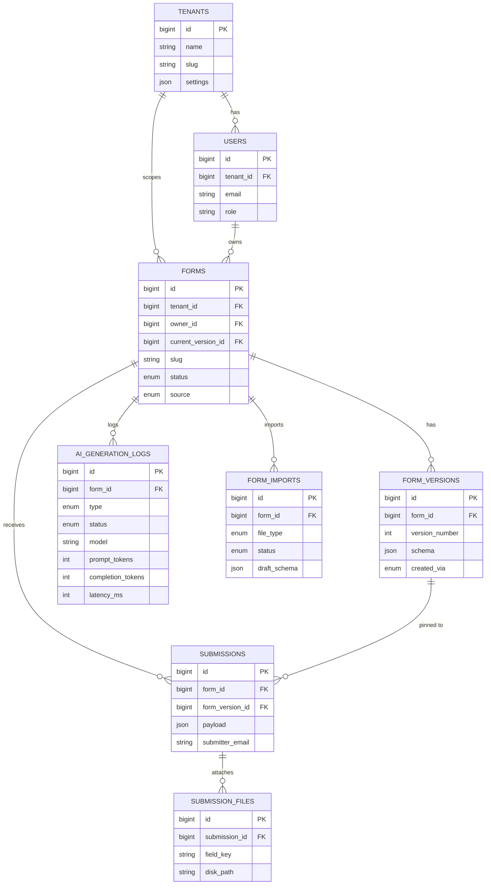

# AI Form Builder

A Laravel + Livewire + MySQL form builder with three ways to create a form:
manually via a drag/drop canvas, generated from a natural-language prompt
via an LLM, or imported from an existing Word/Excel document.

> **Live demo:** _add your deployed URL here_
> **Demo login:** `admin@example.com` / `password` (see `DatabaseSeeder`)

> ⚠️ **Before you submit — two mandatory deliverables you must do yourself:**
> 1. **Deploy this somewhere reachable** (Railway/Render/Hostinger/a VPS all
>    work) and put the live URL + credentials in the two lines above. This
>    was built in a sandboxed environment with no PHP runtime and no
>    outbound access to hosting providers or Packagist, so it could not be
>    deployed or even `composer install`ed here — see §7 below.
> 2. **Push this to a public GitHub repo with real, incremental commits.**
>    A local git history was started for you (see `git log`) covering the
>    major build phases; continue committing as you make changes rather
>    than squashing to one commit — the brief explicitly flags a single
>    "initial commit" as a negative signal.

---

## 1. Setup

```bash
git clone <your-repo-url> form-builder && cd form-builder
composer install
npm install && npm run build   # or `npm run dev` while developing
cp .env.example .env
php artisan key:generate
```

Edit `.env`:
- `DB_*` — a MySQL 8 database (create it first: `CREATE DATABASE form_builder;`)
- `REDIS_*` — used for queues (AI generation and import parsing are queued
  jobs) and for caching the compiled/published schema
- `AI_API_URL`, `AI_API_KEY`, `AI_MODEL` — any OpenAI-chat-completions-compatible
  endpoint (OpenAI, Groq, OpenRouter, or a local Ollama server with the
  OpenAI-compatible shim all work unmodified)

```bash
php artisan migrate --seed
php artisan storage:link
php artisan queue:work        # or `php artisan horizon` — required for AI
                               # generation and imports, both are queued jobs
php artisan serve
```

Run the test suite:

```bash
php artisan test
```

### Auth

Routes assume an `auth` middleware group and a `dashboard`-named route
exist. This scaffold doesn't bundle a specific auth starter kit — install
Laravel Breeze (`composer require laravel/breeze --dev && php artisan
breeze:install`) or Jetstream and it will slot in without changes to
`routes/web.php`.

---

## 2. Architecture overview

```
Builder UI (Livewire)  ─┐
AI generation (queued) ─┼─▶ SchemaValidator ─▶ Form::publishVersion() ─▶ form_versions (JSON)
Import (queued)        ─┘                                                       │
                                                                                 ▼
                                              Form::compiledSchema() (Redis-cached) ─▶ Public Fill page
                                                                                 │
                                                                                 ▼
                                              ValidationRuleBuilder ─▶ Submission (validated, stored)
```

**Every write path funnels through one function:** `Form::publishVersion()`.
It validates the incoming schema with `SchemaValidator` and, only if valid,
writes a new immutable `form_versions` row and repoints
`forms.current_version_id`. This is what guarantees the "never persist a
broken schema" requirement regardless of whether the schema came from the
canvas, the raw JSON editor, an AI job, or a committed import.

### Data model

- `forms` — identity/metadata only (title, slug, status, owner/tenant)
- `form_versions` — **the schema JSON lives here, versioned.** Gives us
  rollback (Part D) essentially for free, and a clean "how did this form get
  this way" audit trail (`created_via`: manual / ai_generate / ai_edit /
  import_docx / import_xlsx / rollback)
- `submissions` / `submission_files` — one JSON payload row per submission
  (deliberately not normalised per-answer — see trade-off in
  `DECISIONS.md`), pinned to the `form_version_id` the submitter actually saw
- `ai_generation_logs` — model, prompt/completion tokens, latency, status,
  per the brief's logging requirement; also backs the job-status polling UI
- `form_imports` — upload → queued parse → preview/mapping → commit state
  machine for Part C
- `tenants` — optional multi-tenant scoping (Part D), a no-op in
  single-tenant installs

### Schema contract

Documented in full in `App\Services\FormSchema\SchemaValidator`'s class
docblock. Short version:

```json
{
  "sections": [
    {
      "key": "personal_info",
      "title": "Personal Information",
      "type": "section",
      "fields": [
        {
          "key": "full_name",
          "type": "text",
          "label": "Full name",
          "required": true,
          "options": null,
          "validation": { "min": null, "max": null, "regex": null }
        }
      ]
    }
  ]
}
```

Field types (10+) and which validation knobs apply to each are defined
**once**, in `config/formbuilder.php` — the builder UI, `SchemaValidator`,
`ValidationRuleBuilder`, the AI prompt, and both importers all read from
this single registry, so adding an 11th field type doesn't mean hunting
through five files.

### ERD

A full DDL matching every migration exactly is at `database/schema.sql`
(see the note at the top of that file re: how to regenerate it with a real
`mysqldump` once you have the project running).



---

## API endpoints

### Web (session-authenticated, `routes/web.php`)

| Method | Path | Purpose |
|---|---|---|
| GET | `/f/{form:slug}` | Public fill page — no auth |
| GET | `/dashboard` | List the current user's forms |
| POST | `/forms` | Create a new blank draft form |
| GET | `/forms/{form}/builder` | Builder canvas + settings + JSON editor + AI editor + version history |
| GET | `/forms/{form}/submissions` | Paginated, searchable submissions list |
| GET | `/forms/{form}/submissions/export` | Streamed CSV export |
| POST | `/forms/{form}/publish` | Flip status to `published` |
| POST | `/forms/{form}/rollback/{version}` | Republish an older version as current |
| GET | `/generate` | AI: create a new form from a prompt |
| GET | `/import` | Word/Excel import wizard |

### REST API (`routes/api.php`, `throttle:60,1`)

| Method | Path | Purpose |
|---|---|---|
| GET | `/api/v1/forms/{form:slug}/schema` | Published form's title/description + compiled schema |
| GET | `/api/v1/forms/{form:slug}/submissions` | Paginated submissions (⚠️ auth stub — see §6) |
| POST | `/api/v1/forms/{form:slug}/submissions` | Programmatic submission; fires the tenant's webhook (§5.5) if configured |

---

## 3. Part B — AI generation strategy

**Prompt contract:** the system prompt (see
`FormGenerationService::systemPromptForCreate()`) pins the model to return
*only* a JSON object matching the schema contract above — no prose, no
markdown fences — using `response_format: json_object` where the provider
supports it.

**Validate → repair loop:** every response is run through the same
`SchemaValidator` used everywhere else. If it's invalid JSON, or has a
hallucinated field type, or is missing required keys, we re-prompt (up to
`AI_MAX_RETRIES`, default 3) with the specific validation errors appended,
asking for a corrected JSON object only. If it still fails after all
retries, the job is marked `failed` with the error recorded —
**a broken schema is never persisted.**

**Editing an existing form:** the same service's `edit()` method sends the
current schema + a plain-English instruction ("add an emergency contact
section", "make phone required", "translate labels to Hindi") and asks for
the complete resulting schema back (not a diff), validated the same way.

**Async by design:** both generate and edit are dispatched as queued jobs
(`GenerateFormFromPrompt`, `EditFormWithAi`) so the request thread never
blocks on an LLM call; the Livewire UI polls `ai_generation_logs.status`
every 2s.

**Logging:** every attempt (including failed/repaired ones — via
cumulative token counts) writes `model`, `prompt_tokens`,
`completion_tokens`, and `latency_ms` to `ai_generation_logs`.

---

## 4. Part C — Word/Excel import strategy

**Hybrid, deterministic-first** (see `App\Services\Import\*`):

1. `WordFormParser` / `ExcelFormParser` do all the structural work —
   detecting sections (headings), field boundaries (question-like lines /
   spreadsheet rows), and option lists (bulleted lists / pipe-separated
   cells) — using plain heuristics. Fast, free, fully explainable, and it's
   what handles the vast majority of real documents.
2. Anything the deterministic pass can't confidently classify is collected
   into `unparsed_blocks` **instead of being silently dropped or guessed
   wrongly** — this is then, and only then, handed to
   `ImportTypeInferencer`, which asks the LLM to infer just `{type,
   validation}` for those specific ambiguous labels (not to regenerate the
   whole form). AI cost and hallucination risk stay proportional to actual
   ambiguity in the source document.
3. The result is always a **draft** — shown on a preview/mapping screen
   (`ImportWizard`) where a human confirms or corrects field types before
   anything becomes a real form. Nothing is committed automatically.

**Excel layouts supported** (see `ExcelFormParser` docblock):
- **Layout A** — a `Label | Type | Required | Options | Help Text` sheet
  (most information-preserving; sample: `database/samples/sample_field_spec_layout.xlsx`)
- **Layout B** — a plain header-row sheet with no type metadata at all, the
  kind of spreadsheet a team might already be using to collect responses
  (sample: `database/samples/sample_plain_header_layout.xlsx`)

**Word:** heading styles → sections; paragraphs ending in `?`/`:` → fields;
bulleted/numbered lists immediately following a question → that field's
options, upgrading its type to radio/checkbox (sample:
`database/samples/sample_job_application.docx`).

---

## 5. Part D — differentiators implemented

1. **Form versioning + rollback** — every save is a new `form_versions` row;
   `Form::rollbackTo()` republishes an old version as the new current one.
2. **Redis-cached compiled schema** — `Form::compiledSchema()` caches the
   published schema per form slug, invalidated on save/delete, so the
   public fill page (the hottest read path) never touches `form_versions`
   on a cache hit.
3. **Rate limiting on public submissions** — `RateLimiter` in
   `Livewire\PublicForm\Fill::submit()`, configurable via
   `FORM_SUBMISSION_RATE_LIMIT`.
4. **Multi-tenant scaffolding** — `tenants` table + a global scope on `Form`
   bound via `app('currentTenantId')`, a no-op when unset.
5. **Public submissions API + webhook** — `routes/api.php` /
   `FormApiController`: fetch a published form's schema, submit
   programmatically, and (if a tenant defines `settings.webhook_url`) get a
   POST on every new submission.

See `DECISIONS.md` for the reasoning behind each and what's still a stub.

---

## 6. Known limitations / what's next

- Drag-and-drop in the builder canvas is wired via native HTML5 drag
  events for click-and-drag-from-palette; a polished multi-field reorder
  (SortableJS `end` → `reorderFields()`) needs its JS bridge wired up in
  `resources/js/app.js`.
- The webhook dispatch in `FormApiController` is synchronous/best-effort;
  production use should move it to a queued job with retries.
- Per-form API tokens are stubbed (`authorizeApiAccess()` currently just
  checks the form is published) — add an `api_token` column and real
  bearer-token auth before exposing this publicly.
- `ImportTypeInferencer` calls the same chat-completions endpoint as form
  generation; for high-volume imports you'd want a cheaper/faster model
  configured separately.

---

## 7. How this was built, and what to verify yourself

This project was scaffolded in a sandboxed environment with **no PHP/Composer
runtime and no outbound network access to Packagist, npm registries used at
install time, or hosting providers**. Every file was hand-written to correct
Laravel 11 / Livewire 3 conventions, but none of it has been run yet. Before
you present this, please:

```bash
composer install          # first real syntax/dependency check
php artisan test           # run the Pest suite in tests/
php artisan migrate --seed # confirm every migration applies cleanly to MySQL
```

If `composer install` or the test suite surfaces anything, that's expected
for a first real run — fix forward and add the fix as its own commit; a
"builds clean on the first real run" repo is less convincing in a live
walkthrough than one with an honest, visible commit history of getting
there, which is exactly what the brief asks for.
